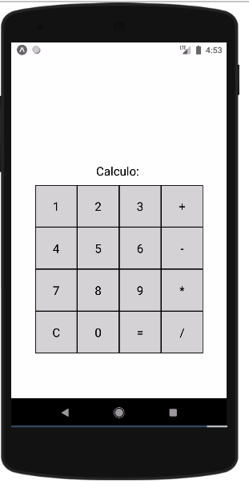
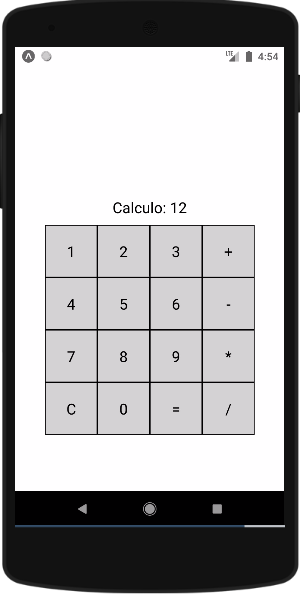
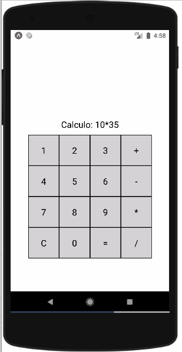
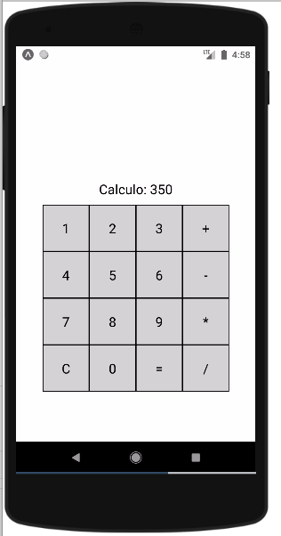

# serie7
Sistema Operacional utilizado: Ubuntu 20.04

A aplicação está presente em **https://expo.io/@alpha71/projects/serie7-leogomes**

Ao entrá na url acima a tela inicial apresentada é:

Clicando nos digitos, o numero ficará sendo formado logo acima do teclado, como apresentado na figura a baixo:

Assim, basta digitar o primeiro número, clicar na operação desejada, digitar o segundo número e clicar no sinal de igual para receber o resulta. Caso tenha digitado algo errado basta clicar na tecla **C** para reiniciar.

Em seguida estão apresentado os testes para o funcionamento de cada uma das quatro operações:

-Adição:

-Subtração:

-Multiplicação:

-Divisão:

